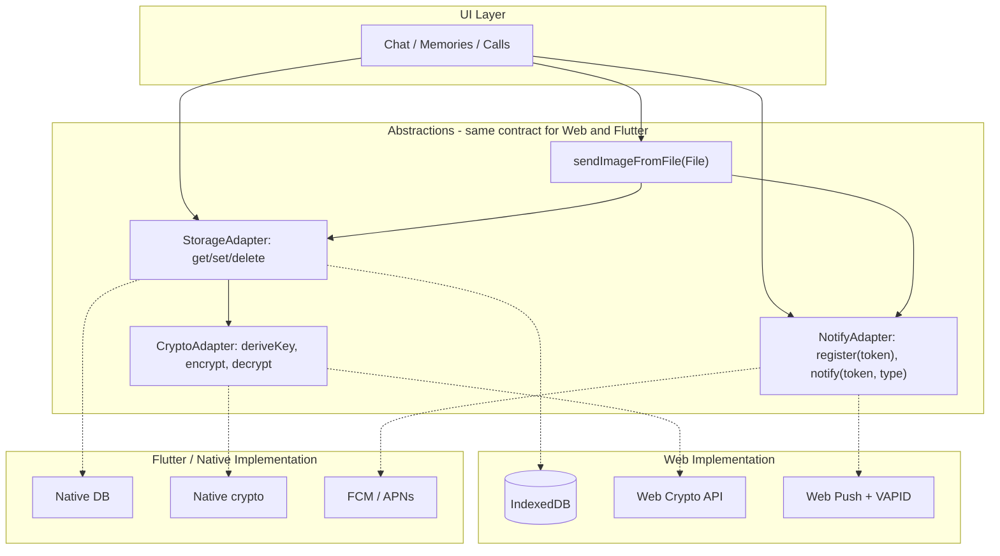

# Dodi App Store Readiness Plan

## Current state (from codebase)

- **Build:** Vite, root `client/`, output `dist/public`; SPA rewrites in [vercel.json](vercel.json). No Capacitor or native tooling yet.
- **PWA:** Manual [client/public/sw.js](client/public/sw.js) + [client/public/manifest.json](client/public/manifest.json); SW registered in [client/index.html](client/index.html). No Vite PWA plugin.
- **Storage:** Single IndexedDB `dodi-encrypted-storage` (v4) via [client/src/lib/storage.ts](client/src/lib/storage.ts); encrypted layer in [client/src/lib/storage-encrypted.ts](client/src/lib/storage-encrypted.ts); Web Crypto (PBKDF2 + AES-GCM) in [client/src/lib/crypto.ts](client/src/lib/crypto.ts). Media blobs in `messageMedia` / `memoryMedia`; settings mirrored in localStorage (`dodi-`*).
- **Push:** Web Push only. Client subscribes in [client/src/lib/push-register.ts](client/src/lib/push-register.ts) (VAPID); server [api/notify.ts](api/notify.ts) and [api/register.ts](api/register.ts) use Upstash Redis and `web-push`. Notify URL from `VITE_NOTIFY_SERVER_URL`; register/notify called from [client/src/App.tsx](client/src/App.tsx) and [client/src/hooks/use-peer-connection.ts](client/src/hooks/use-peer-connection.ts).
- **P2P:** PeerJS ([client/src/hooks/use-peer-connection.ts](client/src/hooks/use-peer-connection.ts)) for signaling + data channel; SimplePeer in [client/src/pages/calls.tsx](client/src/pages/calls.tsx) for voice/video. getUserMedia in chat (video/voice) and calls.
- **Image send:** [client/src/pages/chat.tsx](client/src/pages/chat.tsx) uses `processImageFile` (inline) and `sendMedia` from `usePeerConnection`; no shared "send image from File" API. Memories use similar flow in [client/src/pages/memories.tsx](client/src/pages/memories.tsx).

---

## Architecture: contracts for WebView and Flutter

The goal: **UI and business logic depend on adapters (storage, crypto, notify, send-image)**. Web uses current Idb/WebCrypto/Web Push; Flutter later implements the same adapters with native DB, native crypto, and FCM/APNs.

---

## Phase 1: WebView (Capacitor) readiness

**1.1 Add Capacitor and native projects**

- Add `@capacitor/core` and `@capacitor/cli`; add `@capacitor/ios` and `@capacitor/android`.
- Run `npx cap init` with app id (e.g. `com.dodi.app`), name "dodi", and **web asset directory** pointing at `dist/public` (Vite output).
- Ensure Vite build outputs to a single folder (already `dist/public`). Add `npm run build && npx cap sync` (or copy step) so native projects get the built web app.
- Create iOS and Android projects: `npx cap add ios`, `npx cap add android`. Do not commit large native binaries if repo size is a concern; document "run cap add after clone" or use git-lfs.

**1.2 Capacitor config and base URL**

- Add [capacitor.config.ts](capacitor.config.ts) (or .json) at repo root: set `webDir` to `dist/public`, `server.url` only for live reload in dev, and app id/name.
- Ensure the app loads correctly when the WebView opens `file://` or `capacitor://` (Capacitor serves from webDir). If the app uses client-side routing (wouter), base path should be `/`; no change if already root-relative.
- In [client/index.html](client/index.html), confirm manifest and assets use root-relative paths so they work inside the native WebView.

**1.3 Plugins to add and verify (WebView phase)**

| Capability                    | Plugin / approach                                | Purpose                                                                                                                                                                                                                                     |
| ----------------------------- | ------------------------------------------------ | ------------------------------------------------------------------------------------------------------------------------------------------------------------------------------------------------------------------------------------------- |
| **Status bar / safe area**    | `@capacitor/status-bar`                          | Theming and notch/safe area; you already use CSS `env(safe-area-inset-*)` in index.html.                                                                                                                                                    |
| **Splash screen**             | `@capacitor/splash-screen`                       | Show splash until WebView ready; hide in `main.tsx` or after first paint.                                                                                                                                                                   |
| **Push notifications**        | `@capacitor/push-notifications` (FCM/APNs)       | In WebView, Web Push may not work when app is in background. For store builds, register FCM/APNs token and send to your existing notify API (see Phase 3).                                                                                  |
| **Keyboard / GIF**            | Optional: custom plugin or `@capacitor/keyboard` | WebView cannot enable GBoard GIF in contenteditable; optional plugin could expose a "pick image" intent and return file to JS. Defer if not blocking launch.                                                                                |
| **Secure storage (Keychain)** | `@capacitor/preferences` (Keychain on iOS)       | **Required** before store ship. iOS evicts WKWebView/IndexedDB under memory pressure with no warning. Store passphrase, PIN hash, and mirrors (e.g. `dodi-userId`, `dodi-pinEnabled`) in Keychain via Preferences so they survive eviction. |
| **App state**                 | Built-in (Capacitor App plugin)                  | Pause/resume, back button; useful for reconnecting P2P and clearing sensitive UI when backgrounded.                                                                                                                                         |

**1.4 Permissions and store metadata**

- **iOS:** In Xcode, add capability "Push Notifications"; in Info.plist add usage descriptions for camera (NSCameraUsageDescription), microphone (NSMicrophoneUsageDescription), and optionally photo library (NSPhotoLibraryUsageDescription) if you add explicit gallery picker for GIF.
- **Android:** In AndroidManifest.xml, declare permissions for camera, microphone, internet, and (if needed) RECORD_AUDIO, VIBRATE; no special storage permission if you only use MediaStore / SAF for picks.
- **Manifest and icons:** [client/public/manifest.json](client/public/manifest.json) already has name, icons 192/512, theme_color. Ensure `dist/public` has correct icons (e.g. [client/public/dodi-icon.png](client/public/dodi-icon.png) or similar). For stores, generate all required icon sizes (Android mipmap, iOS AppIcon) from a single 1024x1024 asset.

**1.5 Build and run**

- Script: `npm run build && npx cap sync` then open Xcode/Android Studio and run on device or simulator. Fix any path or CORS issues (Capacitor serves from file/capacitor by default; no CORS for same-origin). Ensure PeerJS, Vercel API, and notify server are reachable (HTTPS); no mixed content.

---

## Phase 2: Code and docs that help Flutter later

Phase 2 focuses on **documenting contracts** and one shared API that unblocks store and Flutter. Defer **implementing** storage/crypto/notify adapters until Flutter actually starts; the adapter pattern is the right end state but adds complexity now with benefit only when Flutter happens. Keep a single markdown contract doc and the diagram below as the source of truth.

**2.1 Single "send image from File" API**

- **Current:** [client/src/pages/chat.tsx](client/src/pages/chat.tsx) defines `processImageFile` and uses `sendMedia` from [client/src/hooks/use-peer-connection.ts](client/src/hooks/use-peer-connection.ts). Memories have similar but separate logic.
- **Change:** Extract a single, documented function (e.g. in `client/src/lib/send-image.ts` or inside a small module) that: accepts `File` (or `Blob` + filename/mime), validates type/size, creates message record, saves preview (and optional full) blob via existing storage, sends metadata via P2P, sends media via `sendMedia`. Chat and Memories (and any future GIF picker or native bridge) call this. Signature should be reusable from a Flutter bridge (e.g. "sendImageFromFile(file: File, options: { kind: 'message' | 'memory', isDisappearing?: boolean })").
- **Flutter benefit:** Native/Flutter can obtain a file from the keyboard or picker and call the same contract over a bridge (e.g. pass base64 or file path; WebView turns it into File and calls this API).

**2.2 Storage and crypto contract (document only; defer adapter code)**

- **Current:** Direct use of [client/src/lib/storage.ts](client/src/lib/storage.ts), [client/src/lib/storage-encrypted.ts](client/src/lib/storage-encrypted.ts), [client/src/lib/crypto.ts](client/src/lib/crypto.ts).
- **Change:** In `docs/app-store-readiness.md` (or a dedicated contract doc), **document** the contract: list of store names, key shapes, encryption format (PBKDF2 iterations, AES-GCM, IV length, base64). Do **not** introduce adapter code (storage-adapter.ts, crypto-adapter.ts) in this phase. When Flutter starts, implement the adapters against this doc; the diagram above remains the target architecture.

**2.3 Notify (push) contract**

- **Current:** [client/src/lib/push-register.ts](client/src/lib/push-register.ts) uses Web Push and POSTs to `getNotifyServerUrl() + '/register'` with `{ token, subscription }`. [api/register.ts](api/register.ts) stores by token; [api/notify.ts](api/notify.ts) sends via web-push.
- **Change:** Document the **register/notify API contract**: (1) Register: POST body with at least `token` (string) and either `subscription` (Web Push) or `platformToken` (FCM/APNs) and `platform: 'ios'|'android'`. (2) Notify: unchanged (token + type). Server changes: in a later phase, support storing FCM/APNs tokens and sending via Firebase Admin / APNs instead of web-push when platform is native. Client: keep current Web Push path for web; in Capacitor, add a step that gets FCM/APNs token and POSTs it with `platform` so server can choose send path. No breaking change to existing web deploy.

**2.4 Message and sync shape (document only)**

- Document the P2P message types and payloads (e.g. `message`, `message-delete`, `memory`, `memory-delete`, `calendar_event`, `partner_detail`, `beloved_survey`, call-offer, call-signal, etc.) and the media send shape (`mediaId`, `kind`, `mime`, `variant`, optional `blob`). Flutter will need to send the same JSON and same media chunks; having a single doc or type file helps.

---

## Phase 3: Plugins and functions that must work in the app stores

**3.1 Push notifications**

- **Web (current):** Web Push + VAPID; SW in [client/public/sw.js](client/public/sw.js) handles push and shows notification. Works in browser and may work in WebView when app is in foreground; often **does not** when app is backgrounded on iOS/Android.
- **Store (WebView):** Use Capacitor Push Notifications plugin to obtain FCM (Android) or APNs (iOS) token; POST that token to the same `/register` endpoint (extend body with `platform` and token). Backend: add a branch in [api/notify.ts](api/notify.ts) (or a small FCM/APNs sender) to send to FCM/APNs when the stored registration is native. Keep Web Push for web; use FCM/APNs for Capacitor builds.
- **Flutter later:** Same contract: register FCM/APNs token with your backend; backend sends via FCM/APNs. No change to notify API shape.

**3.2 Storage and encryption**

- **WebView:** IndexedDB and Web Crypto are available in the WebView. Ensure no assumptions about "browser" (e.g. avoid chrome.runtime if any). [client/src/lib/clear-app-data.ts](client/src/lib/clear-app-data.ts) must run correctly (localStorage, IndexedDB, caches, service worker unregister). On logout, [client/src/contexts/DodiContext.tsx](client/src/contexts/DodiContext.tsx) already clears stores; confirm the list matches all stores in [client/src/lib/storage.ts](client/src/lib/storage.ts) (messages, memories, calendarEvents, settings, messageMedia, memoryMedia, offlineQueue, offlineMediaQueue, partnerDetails, momentQuestionProgress, belovedSurveys, etc.).
- **Flutter:** Implement the same key derivation (PBKDF2 600k, AES-GCM) and store layout in native DB; implement adapter so app code stays unchanged.

**3.3 Media (camera, mic, playback)**

- **WebView:** `getUserMedia` and `MediaRecorder` work in Capacitor WebView. Ensure HTTPS or capacitor:// so permissions are stable. List all uses: [client/src/pages/chat.tsx](client/src/pages/chat.tsx) (video message, voice note), [client/src/pages/calls.tsx](client/src/pages/calls.tsx) (call audio/video). No change needed for Phase 1 if already working in mobile browser.
- **Flutter:** Will use native camera/audio APIs; only the **message format** and **sendMedia** contract need to match (already covered by send-image API and P2P contract).

**3.4 P2P (PeerJS and SimplePeer)**

- **WebView:** PeerJS and SimplePeer run in the WebView. Ensure WebRTC is allowed (no special config on Capacitor by default). PeerJS server (0.peerjs.com) and your notify server must be reachable; no certificate or CORS issues.
- **iOS WebView WebRTC:** Known issues — ICE candidate gathering when the app is backgrounded or screen locks can drop calls. **Test early on real device:** calls, chat media, reconnect after background. May need keepAlive or reconnect logic; document as a known limitation if unfixable.
- **Flutter:** Would replace with native WebRTC or a different signaling path; out of scope for WebView phase. Document the signaling and data message format for future parity.

**3.5 Background and lifecycle**

- **WebView:** Use Capacitor App plugin: listen for `pause` / `resume`. On pause, consider clearing sensitive UI (e.g. message draft) and ensuring P2P reconnect logic runs on resume (already in [client/src/hooks/use-peer-connection.ts](client/src/hooks/use-peer-connection.ts)). Optional: use `document.visibilitychange` as today.
- **Service worker:** In Capacitor, the service worker does **not** run meaningfully; treat it as **disabled/skipped in native builds**. Push display → Capacitor Push Notifications plugin (native). Caching → not needed (assets are bundled in APK/IPA). Background sync → Capacitor Background Runner plugin if ever needed. Keep SW for **web** deploy only.

**3.6 Deep links and share (optional)**

- For "Open in Dodi" or "Share to Dodi", add Capacitor plugins (App Links / Share). Defer if not required for v1.

---

## Phase 4: Store submission checklist

- **Accounts:** Apple Developer Program; Google Play Developer.
- **App identity:** Bundle id / package name; app name; icons (all sizes); splash.
- **Privacy:** Privacy policy URL (hosted); in-app disclosure if you collect any data (Dodi is minimal; state "encrypted on device" and "not shared with third parties").
- **Store listings:** Short/long description; screenshots (phone and optionally tablet); category (e.g. Lifestyle / Social); content rating questionnaire.
- **Compliance — Apple App Privacy:** Apple's nutrition label is granular. PeerJS uses 0.peerjs.com for signaling; that third-party server sees users' IPs and peer IDs (ephemeral). Declare **"IP address"** under **"Data Not Linked to You"** (or equivalent). Google Data safety: same disclosure.
- **Build:** Archive (iOS) and bundle (Android); upload to App Store Connect and Play Console. First review can take several days.

---

## Implementation order (recommended)

Adjusted to address iOS storage risk (Keychain before ship) and to defer Flutter adapter code until Flutter starts.

| Step | Task                                                                                                                                                                                                                      |
| ---- | ------------------------------------------------------------------------------------------------------------------------------------------------------------------------------------------------------------------------- |
| 1    | Add Capacitor (init, ios, android); set webDir to dist/public; add npm scripts (build, sync, open ios/android).                                                                                                           |
| 2    | **Passphrase + PIN → Keychain** via `@capacitor/preferences` (required before store ship). Mirror passphrase, PIN hash, and critical keys (e.g. `dodi-userId`, `dodi-pinEnabled`) so they survive iOS WKWebView eviction. |
| 3    | Add Status Bar and Splash Screen plugins; configure icons and splash for both platforms.                                                                                                                                  |
| 4    | Add Push Notifications plugin; implement FCM/APNs token retrieval in Capacitor build; extend register API to accept native token + platform; extend notify to send via FCM/APNs when platform is native.                  |
| 5    | **Test WebRTC on real device:** calls, chat media, reconnect after background/screen lock; fix ICE or keepAlive issues; document limitations.                                                                             |
| 6    | Implement single `sendImageFromFile` (or equivalent) in a shared module; wire Chat and Memories to it; document signature for native/bridge.                                                                              |
| 7    | Harden clear-app-data and logout to include every store; verify in WebView.                                                                                                                                               |
| 8    | Add iOS/Android permissions and metadata; generate store assets; prepare privacy labels (PeerJS IP disclosure); run first store build and fix runtime issues.                                                             |
| 9    | **Later (when Flutter starts):** Introduce storage/crypto/notify adapters per documented contracts; keep this plan + contract doc as single source of truth.                                                              |

*Implementation order reflects review: Keychain required (step 2) due to iOS IndexedDB eviction risk; WebRTC testing early (step 5); Flutter adapter code deferred to step 9; SW disabled in native builds; App Privacy disclosure for PeerJS (Phase 4).*

---

## Files to add or touch (summary)

| Area           | Files                                                                                                                                                                                                                                                                                                                              |
| -------------- | ---------------------------------------------------------------------------------------------------------------------------------------------------------------------------------------------------------------------------------------------------------------------------------------------------------------------------------- |
| Capacitor      | New: `capacitor.config.ts`; new: `ios/`, `android/` (or add to .gitignore and document generation).                                                                                                                                                                                                                                |
| Keychain       | Add `@capacitor/preferences`; change init/auth/PIN code to read/write passphrase, PIN hash, and mirrors (e.g. `dodi-userId`, `dodi-pinEnabled`) via Preferences (Keychain on iOS). Fallback to current Idb/localStorage when not in Capacitor.                                                                                     |
| Send image     | New: `client/src/lib/send-image.ts` (or similar); change: [client/src/pages/chat.tsx](client/src/pages/chat.tsx), [client/src/pages/memories.tsx](client/src/pages/memories.tsx), [client/src/hooks/use-peer-connection.ts](client/src/hooks/use-peer-connection.ts) (keep sendMedia, call from send-image).                       |
| Push (native)  | Change: [client/src/lib/push-register.ts](client/src/lib/push-register.ts) (Capacitor path: get FCM/APNs token, POST to register with platform); change: [api/register.ts](api/register.ts) (accept platform + token); change: [api/notify.ts](api/notify.ts) or new serverless function (send via FCM/APNs when platform is set). |
| Clear / logout | Verify: [client/src/lib/clear-app-data.ts](client/src/lib/clear-app-data.ts), [client/src/contexts/DodiContext.tsx](client/src/contexts/DodiContext.tsx) clear all stores.                                                                                                                                                         |
| Docs           | New: `docs/app-store-readiness.md` (contracts: storage/crypto/notify/message shapes; plugin list; SW disabled in native; privacy label notes; Flutter migration when adapters are implemented).                                                                                                                                    |

No edits to the plan file itself; this plan is the single source of truth for the transition.