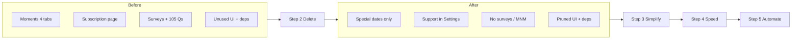

# Elon's 5-Step Algorithm Applied to Dodi

## STEP 1: Requirements Audit

**Question every feature/screen/dependency against: "ambient garden — no homework, no pressure."**

- **Making New Moments (105 questions, 3 paths)** — client/src/lib/moment-questions.ts, client/src/components/moments/making-new-moments-tab.tsx  
**Why dumb:** Structured Q&A flows feel like homework/date-night worksheets, not ambient presence. "Progressive questions for date nights" is tasky.
- **My Beloved / Beloved surveys (love language, attachment, apology)** — client/src/lib/beloved-surveys.ts, client/src/components/moments/my-beloved-tab.tsx  
**Why dumb:** Forms and multi-step surveys create obligation; attunement can be ambient (e.g. gentle prompts in Heart Space) rather than a dedicated "fill this out" tab.
- **Saved Partner Details (notes about partner)** — client/src/components/moments/saved-partner-details-tab.tsx  
**Why dumb:** Explicit "notes about your partner" can feel like admin; optional and low-use. Could fold into one lightweight "About us" note or drop.
- **Calendar events / Our Moments (anniversaries, special dates)** — client/src/pages/our-moments.tsx  
**Why dumb:** Calendar + "Making New Moments" + "My Beloved" + "Saved Partner Details" makes Moments a heavy, multi-tab hub. Keeping a single "special dates" list (anniversary, birthday) is enough for delight; the rest is tasky.
- **Subscription / Support the Garden** — client/src/pages/subscription.tsx, client/src/components/support-invitation.tsx  
**Why dumb:** Vision says "ZERO guilt." Optional support is fine; a full subscription page + support invitation cards can feel like paywall pressure. Simplify to one "Support" section in Settings (link or inline CTA) and remove the dedicated route + modal invitations.
- **Developer Diagnostics** — client/src/components/developer-diagnostics.tsx  
**Why dumb:** Dev-only; not part of the couple experience. Keep only if you need it for debugging; otherwise remove from Settings or gate behind a hidden trigger.
- **Privacy Health Check** — client/src/components/privacy-health-check.tsx  
**Why dumb:** One-time reassurance is fine; if it's a recurring "check" or long copy, it adds cognitive load. Simplify to a short "Your data stays on your devices" line in Settings or remove.
- **Onboarding tutorial** — client/src/pages/onboarding.tsx  
**Why dumb:** Long tutorials fight "effortless, magical." Prefer a single "Welcome — your garden is just you two" screen and one tap to enter, or skip entirely after first launch.
- **Redundancy / Backup & Restore** — client/src/pages/redundancy.tsx  
**Why dumb:** Necessary for safety but can be one simple "Backup this device" / "Restore from another device" flow; audit for verbosity and steps.
- **Unused UI and deps:**  
**Why dumb:** Dead code and unused deps bloat bundle and maintenance.  
  - **Unused UI components** (no imports from app code): client/src/components/ui/chart.tsx (recharts), client/src/components/ui/carousel.tsx (embla-carousel-react), client/src/components/ui/drawer.tsx (vaul), client/src/components/ui/resizable.tsx (react-resizable-panels), client/src/components/ui/sidebar.tsx, client/src/components/ui/menubar.tsx, client/src/components/ui/navigation-menu.tsx, client/src/components/ui/breadcrumb.tsx, client/src/components/ui/accordion.tsx, client/src/components/ui/aspect-ratio.tsx, client/src/components/ui/progress.tsx, client/src/components/ui/calendar.tsx (react-day-picker), client/src/components/ui/command.tsx (cmdk), client/src/components/ui/input-otp.tsx (input-otp).  
  - **Unused deps:** `recharts`, `embla-carousel-react`, `vaul`, `react-resizable-panels`, `cmdk`, `input-otp` (pairing is code-only; no QR; see [AUDIT_REPORT.md](AUDIT_REPORT.md)). `html5-qrcode` and `qrcode.react` already removed.  
  - **Already removed in branch:** `vite-plugin-pwa` (per [.cursor/plans/npm_audit_vite_pwa_upgrade.plan.md](.cursor/plans/npm_audit_vite_pwa_upgrade.plan.md)); confirm it stays removed.
- **Server after pairing (notify/register)** — api/notify.ts, api/register.ts  
**Why dumb:** Vision says "ZERO server after pairing." These are the **only** server touch: push registration and wake-up notifications. Minimal and necessary for "wake partner when app is closed." Keep but treat as the one justified exception; no other server logic.

---

## STEP 2: Delete Plan

**Format: Path → Reason → Risk**

- **client/src/components/ui/chart.tsx** → Unused; recharts is heavy. → **Low**
- **client/src/components/ui/carousel.tsx** → Unused; embla not used anywhere. → **Low**
- **client/src/components/ui/drawer.tsx** → Unused (vaul). → **Low**
- **client/src/components/ui/resizable.tsx** → Unused (react-resizable-panels). → **Low**
- **client/src/components/ui/sidebar.tsx** → Unused; app uses bottom nav. → **Low**
- **client/src/components/ui/menubar.tsx** → Unused. → **Low**
- **client/src/components/ui/navigation-menu.tsx** → Unused. → **Low**
- **client/src/components/ui/breadcrumb.tsx** → Unused. → **Low**
- **client/src/components/ui/accordion.tsx** → Unused. → **Low**
- **client/src/components/ui/aspect-ratio.tsx** → Unused. → **Low**
- **client/src/components/ui/progress.tsx** → Unused (pairing uses custom div + framer-motion). → **Low**
- **client/src/components/ui/calendar.tsx** → Unused (our-moments uses plain date input, not DayPicker). → **Low**
- **client/src/components/ui/command.tsx** → Unused (cmdk). → **Low**
- **client/src/components/ui/input-otp.tsx** → Unused (pin uses plain Input). → **Low**
- **client/src/lib/moment-questions.ts** → Making New Moments = tasky; remove question bank. → **Medium** (removes a whole feature)
- **client/src/components/moments/making-new-moments-tab.tsx** → Remove Making New Moments tab. → **Medium**
- **client/src/lib/beloved-surveys.ts** → Surveys = homework; remove. → **Medium**
- **client/src/components/moments/my-beloved-tab.tsx** → Remove My Beloved tab. → **Medium**
- **client/src/components/moments/saved-partner-details-tab.tsx** → Optional; remove or fold into one note. → **Medium**
- **client/src/pages/subscription.tsx** → Fold into Settings; delete standalone page. → **Low**
- **client/src/components/support-invitation.tsx** → Remove or replace with one Settings CTA. → **Low**
- **client/src/components/developer-diagnostics.tsx** → Remove from Settings or hide behind dev-only flag. → **Low**
- **client/src/components/privacy-health-check.tsx** → Simplify to one line in Settings or remove. → **Low**
- **client/src/pages/our-moments.tsx** → Simplify to "Special dates" only (anniversary + birthday); remove Making New Moments / My Beloved / Saved Partner Details tabs. → **Medium**
- **docs/** (e.g. AUDIT_REPORT.md if not needed), **attached_assets/** (pasted snippets) → Reduce noise. → **Low**
- **Dependencies (package.json):** Remove `recharts`, `embla-carousel-react`, `vaul`, `react-resizable-panels`, `cmdk`, `input-otp`. Remove `react-day-picker` if calendar.tsx deleted. (QR deps already removed; pairing is code-only.) → **Low**
- **IndexedDB / storage:** If Making New Moments + Beloved surveys + Saved Partner Details are removed: drop `momentQuestionProgress`, `belovedSurveys`, `partnerDetails` stores and all related encrypt/sync in client/src/lib/storage.ts, client/src/lib/storage-encrypted.ts, client/src/components/global-sync-handler.tsx. → **Medium** (data model change; ensure no P2P message types reference these)
- **P2P / encryption:** Do **not** delete client/src/lib/crypto.ts, client/src/hooks/use-peer-connection.ts, WebRTC/calls, or message/memory encryption. Flag: any removal of sync handlers for calendar/rituals/love letters/prayers is **High** only if you still use those features; if you simplify Moments to "special dates" only, calendar events stay but partner details/surveys/moment progress can go.

**Risky (you decide):**

- **High:** Changing client/src/hooks/use-peer-connection.ts sync message types or client/src/components/global-sync-handler.tsx for calendar/dailyRitual/loveLetters/prayers — only if you remove those features entirely.
- **Medium:** Dropping Onboarding to a single welcome screen (simplifies flow but changes first-run experience).

---

## STEP 3: Simplify Plan

**For what remains:**

- **Single "Moments" or "Special dates" screen:** One list: anniversary, birthday (from profile), plus optional "Add a date" (name + date). No tabs. Use client/src/pages/our-moments.tsx as base; remove tabs and other tabs' content; keep `getAllCalendarEvents` / `saveCalendarEvent` and minimal UI (list + add dialog). Sync stays in client/src/components/global-sync-handler.tsx for `calendarEvent` only.
- **Support:** One "Support the Garden" block in client/src/pages/settings.tsx: text + button that sets premium (or opens external link). Remove `/subscription` route and client/src/pages/subscription.tsx; remove client/src/components/support-invitation.tsx from Chat/Heart Space or replace with a single non-intrusive line. **Subscription is shared between the couple:** only one partner needs to subscribe; premium applies to both (implement by syncing premium status across the pair, e.g. via a shared flag or P2P/settings so both devices show premium once either has supported).
- **IndexedDB:** After removing surveys/partner details/moment progress, storage has fewer stores. One migration in client/src/lib/storage.ts: bump version, and in upgrade delete or skip creating `partnerDetails`, `belovedSurveys`, `momentQuestionProgress` if you never need to read old data; otherwise keep stores but stop writing.
- **Ambient helps lighter:**  
  - **Presence:** Keep current glow in client/src/App.tsx; ensure it’s a single subtle effect (no extra orbs if heavy).  
  - **Thinking of you:** Already minimal (toast); keep.  
  - **Memory resurfacing:** Keep; ensure it’s one card in chat, not a separate screen.  
  - **Heart Space:** Whispers / Love Notes / Prayers stay; no new tasks.
- **Code sketch — Settings "Support" block (replace subscription route):**

```tsx
// In Settings, add:
<div className="space-y-2">
  <p className="text-sm text-muted-foreground">Dodi is free. Optional support keeps it private and ad-free.</p>
  <Button onClick={() => setPremiumStatus(true)} variant="outline">Support the Garden</Button>
</div>
```

Remove all `setLocation('/subscription')` and SubscriptionPage import; remove support-invitation from Chat/Heart Space or make it a one-line link.

- **Onboarding:** Either one short "Welcome — this is your private garden" + Continue, or skip (hasSeenTutorial = true by default for new installs). Reduces client/src/pages/onboarding.tsx to a minimal view or a single redirect.
- **Redundancy:** Keep one flow: "Backup" (show code) / "Restore" (enter code). Strip extra copy and steps in client/src/pages/redundancy.tsx.

---

## STEP 4: Speed Plan

- **Remove heavy deps (already in Step 2):** Dropping recharts, embla-carousel-react, vaul, react-resizable-panels, cmdk reduces install and bundle size → faster `npm install` and smaller build. (QR deps removed; pairing is code-only.)
- **Lazy-load route chunks:** Use `React.lazy` + `Suspense` for pages: Chat, Our Story (Memories), Heart Space, Calls, Settings. Entry in client/src/App.tsx stays small; tab content loads on first visit. Full detail in **After merge** below.

```tsx
const MemoriesPage = React.lazy(() => import('@/pages/memories'));
// In render: <Suspense fallback={<MinimalSpinner />}><MemoriesPage /></Suspense>
```

- **Vite:** You’re on Vite 7 (from diff). Keep one plugin (e.g. react); Replit plugins only in dev. Ensure `build.rollupOptions.output.manualChunks` splits vendor (react, wouter, peerjs, etc.) from app so caching is effective.
- **Dev server:** Already `host 0.0.0.0`, port 5000. Optional: `server.warmup` (Vite) to pre-transform frequently used files; or reduce `optimizeDeps.include` to only what’s needed to avoid long first load.
- **TypeScript:** `tsc` (check script) only. No extra type-check in build if Vite already runs it; keeps `npm run build` single-pass.
- **No test runner yet:** Adding a minimal Vitest for critical paths (e.g. pairing code validation, crypto round-trip) would be "automate" (Step 5); for raw speed, skipping tests is faster. If you add tests later, run only on changed files (e.g. `vitest run --changed`).

---

## STEP 5: Automation Ideas

**Only after Steps 1–4 (fewer features, less code):**

- **Knip:** Run `knip` (or continue using it) to keep unused exports/declarations removed; run in CI so new dead code is flagged.
- **Bundle size check:** Add a small script or CI step that runs `vite build` and fails if `dist/public` size grows above a threshold (e.g. main chunk > 500 KB). Protects against re-adding heavy deps.
- **Lint + type-check in CI:** `npm run check` (tsc) + ESLint on PRs; no need for heavy E2E initially.
- **Automated dependency audit:** `npm audit` in CI (non-blocking or block on high/critical); keeps known vulns visible after you’ve applied the npm audit plan.

Do **not** automate: deletion of features (manual); DB migrations (run once, manually); push/notify server (already minimal).

---

## Summary Diagram




---

## Combine Plan: Moments → Our Story (inside Memories)

**Goal:** Streamline, not delete. Merge the Moments tab into the existing Memories screen as one unified "Our Story" view. Remove all sub-tabs and tasky features; keep calendar events minimal.

### What "Our Story" Contains

1. **Special dates** — Anniversary, birthday (from profile), add custom (title + date). Minimal list, no tabs.
2. **Auto-resurfaced memories** — "On this day" section: memories from 1, 2, or 3 years ago (same logic as MemoryResurfacing).
3. **Notes on You** — Private notes saved one-tap from chat reactions. Simple list (content + date); add from chat or inline.

### Files to Delete


| File                                                        | Reason                                  |
| ----------------------------------------------------------- | --------------------------------------- |
| client/src/pages/our-moments.tsx                            | Merged into memories.tsx                |
| client/src/lib/moment-questions.ts                          | Remove question bank                    |
| client/src/lib/beloved-surveys.ts                           | Remove surveys                          |
| client/src/components/moments/making-new-moments-tab.tsx    | Remove Making New Moments               |
| client/src/components/moments/my-beloved-tab.tsx            | Remove My Beloved                       |
| client/src/components/moments/saved-partner-details-tab.tsx | Replaced by inline Notes on You section |


After deletions, remove the empty `client/src/components/moments/` folder if no other files remain.

### Files to Modify


| File                                          | Changes                                                                                                                                                |
| --------------------------------------------- | ------------------------------------------------------------------------------------------------------------------------------------------------------ |
| client/src/App.tsx                            | Remove Moments nav item; remove OurMomentsPage import; remove `/moments` route; Memories route stays, points to merged page                            |
| client/src/pages/memories.tsx                 | Rename to "Our Story"; add Special dates section, Resurfaced section, Notes on You section; keep existing memory grid + add dialog                     |
| client/src/pages/chat.tsx                     | Simplify save-as-note: one-tap "Save as note" (remove tag Select); toast "Saved to Our Story → Notes on You"                                           |
| client/src/components/global-sync-handler.tsx | Remove handlers for `partner_detail` if we stop syncing Notes (or keep for P2P sync of notes — recommend keep)                                         |
| client/src/lib/storage.ts                     | Bump DB version; in upgrade, delete `momentQuestionProgress`, `belovedSurveys` object stores (or stop creating them); keep `partnerDetails`            |
| client/src/lib/storage-encrypted.ts           | Remove `saveMomentQuestionProgress`, `getMomentQuestionProgress`; remove beloved survey helpers; keep `savePartnerDetail`, `getPartnerDetailsByUserId` |
| client/src/contexts/DodiContext.tsx           | In clear-app-data, remove `momentQuestionProgress`, `belovedSurveys`; keep `partnerDetails`                                                            |
| client/src/types.ts                           | Remove `MomentQuestionProgress`, `BelovedSurveyId`, `BelovedSurveyAnswer`; simplify `PartnerDetailTag` to single `'note'` or keep for backward compat  |


### Our Story Page Structure (code sketch)

```tsx
// client/src/pages/memories.tsx — structure

export default function MemoriesPage() {
  // Existing: memories, loadMemories, add dialog, etc.
  // Add:
  const [specialDates, setSpecialDates] = useState<CalendarEvent[]>([]);
  const [anniversary, setAnniversary] = useState<CalendarEvent | null>(null);
  const [notesOnYou, setNotesOnYou] = useState<PartnerDetail[]>([]);
  const [resurfacedMemory, setResurfacedMemory] = useState<Memory | null>(null);
  const [resurfacedYearsAgo, setResurfacedYearsAgo] = useState<number | null>(null);

  useEffect(() => {
    loadSpecialDates();
    loadNotesOnYou();
    checkResurfaced();
  }, []);

  const loadSpecialDates = async () => {
    const all = await getAllCalendarEvents();
    const anniv = all.find(e => e.isAnniversary);
    setAnniversary(anniv || null);
    setSpecialDates(all.filter(e => !e.isAnniversary && !e.id.startsWith('birthday-'))
      .sort((a, b) => new Date(a.eventDate).getTime() - new Date(b.eventDate).getTime()));
  };

  const loadNotesOnYou = async () => {
    if (!userId) return;
    const list = await getPartnerDetailsByUserId(userId);
    setNotesOnYou(list.sort((a, b) => new Date(b.createdAt).getTime() - new Date(a.createdAt).getTime()));
  };

  // Resurfaced: 1 match per day max; most recent year first (1, then 2, then 3). If user dismissed "Later", hide for the day (setting resurfacedDismissedAt = today).
  const checkResurfaced = async () => {
    const today = new Date();
    const dismissedAt = await getSetting('resurfacedDismissedAt');
    if (dismissedAt && isSameDay(new Date(Number(dismissedAt)), today)) return; // hide for day
    const all = await getMemories(1000);
    for (const y of [1, 2, 3]) {
      const target = subYears(today, y);
      const match = all.find(m => isSameDay(new Date(m.timestamp), target));
      if (match) {
        setResurfacedMemory(match);
        setResurfacedYearsAgo(y);
        break; // only one match per day
      }
    }
  };
  const onResurfacedDismiss = () => { saveSetting('resurfacedDismissedAt', String(Date.now())); setResurfacedMemory(null); setResurfacedYearsAgo(null); };

  return (
    <div className="flex-1 min-h-0 flex flex-col bg-background">
      <div className="...header...">
        <h2>Our Story</h2>
        <p>Memories, dates, and notes — your private garden</p>
      </div>

      <ScrollArea className="flex-1 min-h-0 p-6">
        <div className="max-w-2xl mx-auto space-y-10">
          {/* 1. Resurfaced (when we have a match) */}
          {resurfacedMemory && resurfacedYearsAgo && (
            <section>
              <h3 className="text-sm font-medium text-muted-foreground mb-2">On this day, {resurfacedYearsAgo} {resurfacedYearsAgo === 1 ? 'year' : 'years'} ago</h3>
              <Card className="p-4 ...">
                <div className="flex gap-4"> ... </div>
                <Button variant="ghost" size="sm" onClick={onResurfacedDismiss}>Later</Button>
              </Card>
            </section>
          )}

          {/* 2. Special dates (anniversary + custom) */}
          <section>
            <h3 className="text-sm font-medium text-muted-foreground mb-2">Special dates</h3>
            {anniversary && <AnniversaryCard anniversary={anniversary} />}
            {specialDates.map(m => <SpecialDateCard key={m.id} event={m} onDelete={...} />)}
            <Button variant="outline" size="sm" onClick={() => setAddDateOpen(true)}>Add date</Button>
          </section>

          {/* 3. Notes on You */}
          <section>
            <h3 className="text-sm font-medium text-muted-foreground mb-2">Notes on you</h3>
            <p className="text-xs text-muted-foreground mb-2">One-tap save from chat reactions. Private, just for you.</p>
            {notesOnYou.map(n => (
              <Card key={n.id} className="p-3 mb-2">
                <p className="text-sm">{n.content}</p>
                <p className="text-[10px] text-muted-foreground mt-1">{format(n.createdAt, 'MMM d, yyyy')}</p>
              </Card>
            ))}
            {notesOnYou.length === 0 && (
              <p className="text-sm text-muted-foreground italic">Long-press a message in Chat → Save as note</p>
            )}
          </section>

          {/* 4. Memories grid (existing) */}
          <section>
            <h3 className="text-sm font-medium text-muted-foreground mb-2">Our memories</h3>
            {/* Existing memory grid + Load more + Add Memory dialog */}
          </section>
        </div>
      </ScrollArea>

      {/* Add date dialog (minimal: title + date + isAnniversary checkbox) */}
      {/* Add memory dialog (existing) */}
      {/* Edit caption dialog (existing) */}
      {/* Fullscreen viewer (existing) */}
    </div>
  );
}
```

### Chat: One-tap "Save as note"

In chat.tsx, simplify the save flow:

- Remove the `Select` for `saveDetailTag`; use fixed `tag: 'remember'` (or add a single `PartnerDetailTag` `'note'` in types).
- When user taps "Save as note" from reaction menu, immediately save with `content` from message (or pre-filled from message text) and show toast "Saved to Our Story".
- Remove the multi-step dialog if possible: consider a single "Save" button that uses `message.content` (or truncated) as the note content. If you need editing, keep a minimal dialog with one `Input` for content.

```tsx
// Simplified handleSaveDetail — no tag picker
const handleSaveDetail = useCallback(async () => {
  if (!saveDetailMessage || !userId || !partnerId) return;
  const content = saveDetailMessage.type === 'text' && saveDetailMessage.content
    ? saveDetailMessage.content.slice(0, 500)
    : `Message from ${format(new Date(saveDetailMessage.timestamp), 'MMM d')}`;
  const detail: PartnerDetail = {
    id: nanoid(),
    userId,
    partnerId,
    content,
    tag: 'remember', // or 'note' if you add it
    messageId: saveDetailMessage.id,
    messageContext: saveDetailMessage.type === 'text' ? saveDetailMessage.content.slice(0, 200) : undefined,
    createdAt: new Date(),
  };
  await savePartnerDetail(detail);
  sendP2P({ type: 'partner_detail', data: detail, timestamp: Date.now() });
  setSaveDetailMessage(null);
  toast({ title: 'Saved to Our Story', description: 'Added to Notes on you.' });
}, [...]);
```

### App.tsx nav change

```tsx
// Remove Moments; Memories label can stay "Memories" or change to "Our Story"
const navItems = [
  { href: '/chat', icon: MessageSquare, label: 'Chat' },
  { href: '/calls', icon: Phone, label: 'Calls' },
  { href: '/memories', icon: Camera, label: 'Our Story' },  // was Memories
  { href: '/heart-space', icon: Heart, label: 'Heart' },
  { href: '/settings', icon: Settings, label: 'Settings' },
];
// Remove any /moments route and OurMomentsPage
```

### Storage / types cleanup

- **Keep:** `partnerDetails` store, `PartnerDetail` type, `savePartnerDetail`, `getPartnerDetailsByUserId`, `partner_detail` sync (P2P notes sync stays).
- **Settings:** Add a Settings toggle **"Sync private notes?"** (default **on**). When off, do not send or accept `partner_detail` P2P messages; notes remain local-only. When on, keep current P2P sync for Notes on You.
- **Remove:** `momentQuestionProgress`, `belovedSurveys` stores; `MomentQuestionProgress`, `BelovedSurveyId`, `BelovedSurveyAnswer` types; `saveMomentQuestionProgress`, `getMomentQuestionProgress`, beloved survey helpers.
- **Optional:** Simplify `PartnerDetailTag` to just `'note'` if you want; existing `'remember'` works fine.

### MemoryResurfacing in Chat

Keep MemoryResurfacing in Chat as-is (floating card when a memory from 1/2/3 years ago exists). Fix: it currently uses `MessageMediaImage` with `messageId={memory.id}` — memories live in `memoryMedia`, not `messageMedia`. Use `MemoryMediaImage` instead:

```tsx
// memory-resurfacing.tsx
<MemoryMediaImage memoryId={memory.id} mediaType={memory.mediaType} />
```

---

## After merge (post–Combine Plan)

Do the following after the Moments → Our Story merge is complete.

### 1. Lazy-load pages with React.lazy + Suspense

Lazy-load route chunks for: **Chat**, **Our Story (Memories)**, **Heart Space**, **Calls**, **Settings**. Keeps initial bundle small; each page loads on first visit.

- In client/src/App.tsx: replace direct imports of `ChatPage`, `MemoriesPage`, `HeartSpacePage`, `CallsPage`, `SettingsPage` with `React.lazy(() => import('@/pages/...'))`.
- Wrap the main content area (or each route branch) in `<Suspense fallback={<MinimalSpinner />}>` so lazy pages show a brief loading state.
- Use a minimal fallback (e.g. centered spinner or skeleton) to avoid layout shift.

### 2. Vite build: minify terser + no sourcemap

In [vite.config.ts](vite.config.ts), add for faster production builds:

- **Minify with terser:** Set `build.minify: 'terser'` (and add `terser` as devDependency if not present). Terser often yields smaller output than esbuild; optional if esbuild minify is fast enough — otherwise use for smaller bundles.
- **No sourcemaps in prod:** Set `build.sourcemap: false` (or omit; default is false for prod). Reduces build time and output size.

```ts
// vite.config.ts — build section
build: {
  outDir: path.resolve(import.meta.dirname, "dist/public"),
  emptyOutDir: true,
  sourcemap: false,
  minify: 'terser',  // optional: add terser to devDependencies
  // ...
},
```

### 3. "Remind me" toggle for special dates (local notification)

On the **Our Story** screen, for each special date (anniversary, birthday, custom dates), add a simple **"Remind me"** toggle. When on, schedule a **local notification** (no server) for that date (e.g. morning of). Use the same calendar-event record; add a field or setting like `remindMe: boolean` (stored in settings keyed by event id, e.g. `dodi-remind-{eventId}`).

- **Implementation:** Browser: `Notification` API. **Check permission when user toggles on** (request permission on toggle; if denied, leave toggle off and optionally toast "Notifications disabled"). On app open / visibility change, if the date is today and not yet notified, show `new Notification(...)`. No push server involved.
- **Storage:** Persist "remind me" choice per event (e.g. in existing settings store or localStorage: `dodi-remind-{calendarEventId}: true`).
- **UX:** Toggle per row/card in the Special dates section; label e.g. "Remind me on this day".

---

## Premium trial / teaser (value-first)

**Trigger:** After the user’s first **delight moment** — e.g. first memory shared (saved to Our Story) or first call attempt (voice/video). Show a soft, value-first prompt once (or after 7-day teaser if you gate some value for 7 days).

**Subscription is shared between the couple:** Only one partner needs to subscribe; premium unlocks for both. Sync premium status across the pair (e.g. store per-pair or broadcast via P2P so both devices show premium when either has supported). Copy can say e.g. “One subscription covers you both.”

**Flow:**

- **7-day teaser:** Optional. For the first 7 days after pairing, full experience is free; no prompt. Or: teaser period where one “premium” benefit is hinted (e.g. “HD clarity” available after trial).
- **30-day trial:** After the first delight moment (first memory share or call attempt), show a single soft prompt that offers a **30-day trial** of premium, then paid tiers. User can dismiss; no guilt. Store `premiumPromptDismissedAt` or `premiumTrialOfferedAt` in settings so the prompt doesn’t re-spam.
- **Tiers:** $3.99/mo, $39.99/yr, $79 lifetime. Display in a small card or modal with value-first copy (benefits first, price second).
- **Soft prompt line:** e.g. *“Unlock HD clarity and deeper magic?”* — focus on benefit, not “upgrade” or “pay”. Optional subline: “30-day free trial, then choose what fits.”
- **Value-first copy:** Lead with what they get (HD video, clearer voice, extra resurfacing, etc.); then show tiers. No pressure; dismiss = “Maybe later” or “Not now”. Link to Settings → Support the Garden for full tiers if they want to see later.

**Implementation:** In the flow where a memory is first saved (memories.tsx or after P2P send) or where a call is first attempted (calls.tsx), check a setting like `hasSeenFirstDelightPrompt` or `firstMemorySharedAt`; if this is the first time, set the flag and show the prompt (card or modal). Use existing `isPremium` / `setPremiumStatus` from DodiContext; trial can set a `trialEndsAt` in settings and treat as premium until that date.

---

## Heart Whispers (optional, skippable)

**Idea:** 2–3 gentle prompts per week from a fixed list of **7**. Never required. Single ambient card **in Chat only** (above messages) for simplicity. Read-only — no input or submit. Optional “Save to Notes” or dismiss. Last shown / dismissed stored in local settings to avoid repeats.

### Plan

- **Frequency:** 2–3 whispers per week. When the user opens **Chat**, show at most one card above the message list; pick a random prompt from the 7 that hasn’t been shown/dismissed recently (see settings).
- **Placement:** **Chat only** — single card above the message list (inline, not floating). No Heart Space placement; keeps implementation simple.
- **Behavior:** Card shows prompt text only. **No input, no submit** — read only. Actions: optional “Save to Notes” (saves prompt text as a PartnerDetail/Note on you) and “Dismiss” (or skip). No completion state.
- **Local settings (avoid repeats):** Store in existing app settings (e.g. via `getSetting` / `saveSetting` or localStorage under a `dodi-` prefix):
  - `lastWhisperShownAt` — timestamp of last time a whisper was shown.
  - `lastWhisperId` — id of the last prompt shown (so we don’t repeat same prompt back-to-back).
  - `dismissedWhisperIds` — array or comma-separated list of prompt ids dismissed this week (or cycle); clear when starting a new week so prompts can reappear later.  
  Use these to decide “should we show a whisper now?” and “which prompt?” (e.g. random from the 7, excluding recently shown/dismissed).
- **Data:** No new DB stores. Prompt list in code only.
- **Files:**
  - New `client/src/lib/heart-whispers.ts`: **7 prompts** (id + text), plus `getNextWhisper(settings)` (or similar) that returns the next prompt to show or `null` if none this slot/week.
  - New `client/src/components/heart-whisper-card.tsx`: card UI (prompt text, “Save to Notes”, “Dismiss”); on dismiss/save, update settings and hide card.
  - Wire **only** into client/src/pages/chat.tsx (above messages).

### Prompt list (7 — use these)

1. What’s one small thing you’re curious about in your partner this week?
2. When did you last feel really seen by each other?
3. What’s a boundary that’s been helping you both lately?
4. What’s one way you’d like to show up for them without them having to ask?
5. When do you feel most yourself with them?
6. What’s something you’ve been meaning to say but haven’t found the moment?
7. What’s one thing you appreciate about how they handle conflict?

Keep tone short, open-ended, non-prescriptive. No right answer; no completion state.

---

## Recommended tweaks (ready to proceed)

- **Nav label:** Use **"Our Story"** for the Memories/Our Story route in app nav.
- **Resurfaced:** Limit to **1 match per day** (most recent year first: 1, then 2, then 3). Add **dismiss:** "Later" hides that resurfaced card for the day (store `resurfacedDismissedAt`; skip showing if same calendar day).
- **Notes sync:** Keep notes P2P sync. Add Settings toggle **"Sync private notes?"** (default **on**). When off, do not send or accept `partner_detail` P2P messages; notes stay local-only.
- **Heart Whispers:** **Chat only** (above messages); **7 prompts** (use the list above).
- **Remind me:** Per special date, "Remind me" toggle uses local Notification API; **check permission when user toggles on** (request on toggle; if denied, leave toggle off).

**Instruction for Cursor:**  
*GO on the combine plan with these tweaks: [list above]. Then implement Heart Whispers as described (Chat-only placement, 7 prompts).*

---

Review this combine plan. Tell me **GO**, **modify**, or **skip**.