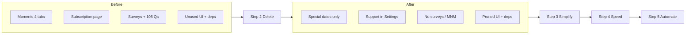

# Elon's 5-Step Algorithm Applied to Dodi

## STEP 1: Requirements Audit

**Question every feature/screen/dependency against: "ambient garden — no homework, no pressure."**

- **Making New Moments (105 questions, 3 paths)** — [client/src/lib/moment-questions.ts](client/src/lib/moment-questions.ts), [client/src/components/moments/making-new-moments-tab.tsx](client/src/components/moments/making-new-moments-tab.tsx)  
**Why dumb:** Structured Q&A flows feel like homework/date-night worksheets, not ambient presence. "Progressive questions for date nights" is tasky.
- **My Beloved / Beloved surveys (love language, attachment, apology)** — [client/src/lib/beloved-surveys.ts](client/src/lib/beloved-surveys.ts), [client/src/components/moments/my-beloved-tab.tsx](client/src/components/moments/my-beloved-tab.tsx)  
**Why dumb:** Forms and multi-step surveys create obligation; attunement can be ambient (e.g. gentle prompts in Heart Space) rather than a dedicated "fill this out" tab.
- **Saved Partner Details (notes about partner)** — [client/src/components/moments/saved-partner-details-tab.tsx](client/src/components/moments/saved-partner-details-tab.tsx)  
**Why dumb:** Explicit "notes about your partner" can feel like admin; optional and low-use. Could fold into one lightweight "About us" note or drop.
- **Calendar events / Our Moments (anniversaries, special dates)** — [client/src/pages/our-moments.tsx](client/src/pages/our-moments.tsx)  
**Why dumb:** Calendar + "Making New Moments" + "My Beloved" + "Saved Partner Details" makes Moments a heavy, multi-tab hub. Keeping a single "special dates" list (anniversary, birthday) is enough for delight; the rest is tasky.
- **Subscription / Support the Garden** — [client/src/pages/subscription.tsx](client/src/pages/subscription.tsx), [client/src/components/support-invitation.tsx](client/src/components/support-invitation.tsx)  
**Why dumb:** Vision says "ZERO guilt." Optional support is fine; a full subscription page + support invitation cards can feel like paywall pressure. Simplify to one "Support" section in Settings (link or inline CTA) and remove the dedicated route + modal invitations.
- **Developer Diagnostics** — [client/src/components/developer-diagnostics.tsx](client/src/components/developer-diagnostics.tsx)  
**Why dumb:** Dev-only; not part of the couple experience. Keep only if you need it for debugging; otherwise remove from Settings or gate behind a hidden trigger.
- **Privacy Health Check** — [client/src/components/privacy-health-check.tsx](client/src/components/privacy-health-check.tsx)  
**Why dumb:** One-time reassurance is fine; if it's a recurring "check" or long copy, it adds cognitive load. Simplify to a short "Your data stays on your devices" line in Settings or remove.
- **Onboarding tutorial** — [client/src/pages/onboarding.tsx](client/src/pages/onboarding.tsx)  
**Why dumb:** Long tutorials fight "effortless, magical." Prefer a single "Welcome — your garden is just you two" screen and one tap to enter, or skip entirely after first launch.
- **Redundancy / Backup & Restore** — [client/src/pages/redundancy.tsx](client/src/pages/redundancy.tsx)  
**Why dumb:** Necessary for safety but can be one simple "Backup this device" / "Restore from another device" flow; audit for verbosity and steps.
- **Unused UI and deps:**  
**Why dumb:** Dead code and unused deps bloat bundle and maintenance.  
  - **Unused UI components** (no imports from app code): [client/src/components/ui/chart.tsx](client/src/components/ui/chart.tsx) (recharts), [client/src/components/ui/carousel.tsx](client/src/components/ui/carousel.tsx) (embla-carousel-react), [client/src/components/ui/drawer.tsx](client/src/components/ui/drawer.tsx) (vaul), [client/src/components/ui/resizable.tsx](client/src/components/ui/resizable.tsx) (react-resizable-panels), [client/src/components/ui/sidebar.tsx](client/src/components/ui/sidebar.tsx), [client/src/components/ui/menubar.tsx](client/src/components/ui/menubar.tsx), [client/src/components/ui/navigation-menu.tsx](client/src/components/ui/navigation-menu.tsx), [client/src/components/ui/breadcrumb.tsx](client/src/components/ui/breadcrumb.tsx), [client/src/components/ui/accordion.tsx](client/src/components/ui/accordion.tsx), [client/src/components/ui/aspect-ratio.tsx](client/src/components/ui/aspect-ratio.tsx), [client/src/components/ui/progress.tsx](client/src/components/ui/progress.tsx), [client/src/components/ui/calendar.tsx](client/src/components/ui/calendar.tsx) (react-day-picker), [client/src/components/ui/command.tsx](client/src/components/ui/command.tsx) (cmdk), [client/src/components/ui/input-otp.tsx](client/src/components/ui/input-otp.tsx) (input-otp).  
  - **Unused deps:** `recharts`, `embla-carousel-react`, `vaul`, `react-resizable-panels`, `cmdk`, `input-otp`, `html5-qrcode`, `qrcode.react` (QR scan/display not used in [client/src/pages/pairing.tsx](client/src/pages/pairing.tsx); room codes only; see [AUDIT_REPORT.md](AUDIT_REPORT.md)).  
  - **Already removed in branch:** `vite-plugin-pwa` (per [.cursor/plans/npm_audit_vite_pwa_upgrade.plan.md](.cursor/plans/npm_audit_vite_pwa_upgrade.plan.md)); confirm it stays removed.
- **Server after pairing (notify/register)** — [api/notify.ts](api/notify.ts), [api/register.ts](api/register.ts)  
**Why dumb:** Vision says "ZERO server after pairing." These are the **only** server touch: push registration and wake-up notifications. Minimal and necessary for "wake partner when app is closed." Keep but treat as the one justified exception; no other server logic.

---

## STEP 2: Delete Plan

**Format: Path → Reason → Risk**

- **client/src/components/ui/chart.tsx** → Unused; recharts is heavy. → **Low**
- **client/src/components/ui/carousel.tsx** → Unused; embla not used anywhere. → **Low**
- **client/src/components/ui/drawer.tsx** → Unused (vaul). → **Low**
- **client/src/components/ui/resizable.tsx** → Unused (react-resizable-panels). → **Low**
- **client/src/components/ui/sidebar.tsx** → Unused; app uses bottom nav. → **Low**
- **client/src/components/ui/menubar.tsx** → Unused. → **Low**
- **client/src/components/ui/navigation-menu.tsx** → Unused. → **Low**
- **client/src/components/ui/breadcrumb.tsx** → Unused. → **Low**
- **client/src/components/ui/accordion.tsx** → Unused. → **Low**
- **client/src/components/ui/aspect-ratio.tsx** → Unused. → **Low**
- **client/src/components/ui/progress.tsx** → Unused (pairing uses custom div + framer-motion). → **Low**
- **client/src/components/ui/calendar.tsx** → Unused (our-moments uses plain date input, not DayPicker). → **Low**
- **client/src/components/ui/command.tsx** → Unused (cmdk). → **Low**
- **client/src/components/ui/input-otp.tsx** → Unused (pin uses plain Input). → **Low**
- **client/src/lib/moment-questions.ts** → Making New Moments = tasky; remove question bank. → **Medium** (removes a whole feature)
- **client/src/components/moments/making-new-moments-tab.tsx** → Remove Making New Moments tab. → **Medium**
- **client/src/lib/beloved-surveys.ts** → Surveys = homework; remove. → **Medium**
- **client/src/components/moments/my-beloved-tab.tsx** → Remove My Beloved tab. → **Medium**
- **client/src/components/moments/saved-partner-details-tab.tsx** → Optional; remove or fold into one note. → **Medium**
- **client/src/pages/subscription.tsx** → Fold into Settings; delete standalone page. → **Low**
- **client/src/components/support-invitation.tsx** → Remove or replace with one Settings CTA. → **Low**
- **client/src/components/developer-diagnostics.tsx** → Remove from Settings or hide behind dev-only flag. → **Low**
- **client/src/components/privacy-health-check.tsx** → Simplify to one line in Settings or remove. → **Low**
- **client/src/pages/our-moments.tsx** → Simplify to "Special dates" only (anniversary + birthday); remove Making New Moments / My Beloved / Saved Partner Details tabs. → **Medium**
- **docs/** (e.g. QR_SCANNING_DEBUG_GUIDE.md, AUDIT_REPORT.md if not needed), **attached_assets/** (pasted snippets) → Reduce noise. → **Low**
- **Dependencies (package.json):** Remove `recharts`, `embla-carousel-react`, `vaul`, `react-resizable-panels`, `cmdk`, `input-otp`, `html5-qrcode`, `qrcode.react`. Remove `react-day-picker` if calendar.tsx deleted. → **Low**
- **IndexedDB / storage:** If Making New Moments + Beloved surveys + Saved Partner Details are removed: drop `momentQuestionProgress`, `belovedSurveys`, `partnerDetails` stores and all related encrypt/sync in [client/src/lib/storage.ts](client/src/lib/storage.ts), [client/src/lib/storage-encrypted.ts](client/src/lib/storage-encrypted.ts), [client/src/components/global-sync-handler.tsx](client/src/components/global-sync-handler.tsx). → **Medium** (data model change; ensure no P2P message types reference these)
- **P2P / encryption:** Do **not** delete [client/src/lib/crypto.ts](client/src/lib/crypto.ts), [client/src/hooks/use-peer-connection.ts](client/src/hooks/use-peer-connection.ts), WebRTC/calls, or message/memory encryption. Flag: any removal of sync handlers for calendar/rituals/love letters/prayers is **High** only if you still use those features; if you simplify Moments to "special dates" only, calendar events stay but partner details/surveys/moment progress can go.

**Risky (you decide):**

- **High:** Changing [client/src/hooks/use-peer-connection.ts](client/src/hooks/use-peer-connection.ts) sync message types or [client/src/components/global-sync-handler.tsx](client/src/components/global-sync-handler.tsx) for calendar/dailyRitual/loveLetters/prayers — only if you remove those features entirely.
- **Medium:** Dropping Onboarding to a single welcome screen (simplifies flow but changes first-run experience).

---

## STEP 3: Simplify Plan

**For what remains:**

- **Single "Moments" or "Special dates" screen:** One list: anniversary, birthday (from profile), plus optional "Add a date" (name + date). No tabs. Use [client/src/pages/our-moments.tsx](client/src/pages/our-moments.tsx) as base; remove tabs and other tabs' content; keep `getAllCalendarEvents` / `saveCalendarEvent` and minimal UI (list + add dialog). Sync stays in [client/src/components/global-sync-handler.tsx](client/src/components/global-sync-handler.tsx) for `calendarEvent` only.
- **Support:** One "Support the Garden" block in [client/src/pages/settings.tsx](client/src/pages/settings.tsx): text + button that sets premium (or opens external link). Remove `/subscription` route and [client/src/pages/subscription.tsx](client/src/pages/subscription.tsx); remove [client/src/components/support-invitation.tsx](client/src/components/support-invitation.tsx) from Chat/Heart Space or replace with a single non-intrusive line.
- **IndexedDB:** After removing surveys/partner details/moment progress, storage has fewer stores. One migration in [client/src/lib/storage.ts](client/src/lib/storage.ts): bump version, and in upgrade delete or skip creating `partnerDetails`, `belovedSurveys`, `momentQuestionProgress` if you never need to read old data; otherwise keep stores but stop writing.
- **Ambient helps lighter:**  
  - **Presence:** Keep current glow in [client/src/App.tsx](client/src/App.tsx); ensure it’s a single subtle effect (no extra orbs if heavy).  
  - **Thinking of you:** Already minimal (toast); keep.  
  - **Memory resurfacing:** Keep; ensure it’s one card in chat, not a separate screen.  
  - **Heart Space:** Whispers / Love Notes / Prayers stay; no new tasks.
- **Code sketch — Settings "Support" block (replace subscription route):**

```tsx
// In Settings, add:
<div className="space-y-2">
  <p className="text-sm text-muted-foreground">Dodi is free. Optional support keeps it private and ad-free.</p>
  <Button onClick={() => setPremiumStatus(true)} variant="outline">Support the Garden</Button>
</div>
```

Remove all `setLocation('/subscription')` and SubscriptionPage import; remove support-invitation from Chat/Heart Space or make it a one-line link.

- **Onboarding:** Either one short "Welcome — this is your private garden" + Continue, or skip (hasSeenTutorial = true by default for new installs). Reduces [client/src/pages/onboarding.tsx](client/src/pages/onboarding.tsx) to a minimal view or a single redirect.
- **Redundancy:** Keep one flow: "Backup" (show code) / "Restore" (enter code). Strip extra copy and steps in [client/src/pages/redundancy.tsx](client/src/pages/redundancy.tsx).

---

## STEP 4: Speed Plan

- **Remove heavy deps (already in Step 2):** Dropping recharts, embla-carousel-react, vaul, react-resizable-panels, cmdk, html5-qrcode, qrcode.react reduces install and bundle size → faster `npm install` and smaller build.
- **Lazy-load route chunks:** Use `React.lazy` + `Suspense` for pages: Chat (if heavy), Memories, Our Moments, Heart Space, Calls, Settings. Entry in [client/src/App.tsx](client/src/App.tsx) stays small; tab content loads on first visit. Example:

```tsx
const MemoriesPage = React.lazy(() => import('@/pages/memories'));
// In render: <Suspense fallback={<MinimalSpinner />}><MemoriesPage /></Suspense>
```

- **Vite:** You’re on Vite 7 (from diff). Keep one plugin (e.g. react); Replit plugins only in dev. Ensure `build.rollupOptions.output.manualChunks` splits vendor (react, wouter, peerjs, etc.) from app so caching is effective.
- **Dev server:** Already `host 0.0.0.0`, port 5000. Optional: `server.warmup` (Vite) to pre-transform frequently used files; or reduce `optimizeDeps.include` to only what’s needed to avoid long first load.
- **TypeScript:** `tsc` (check script) only. No extra type-check in build if Vite already runs it; keeps `npm run build` single-pass.
- **No test runner yet:** Adding a minimal Vitest for critical paths (e.g. pairing code validation, crypto round-trip) would be "automate" (Step 5); for raw speed, skipping tests is faster. If you add tests later, run only on changed files (e.g. `vitest run --changed`).

---

## STEP 5: Automation Ideas

**Only after Steps 1–4 (fewer features, less code):**

- **Knip:** Run `knip` (or continue using it) to keep unused exports/declarations removed; run in CI so new dead code is flagged.
- **Bundle size check:** Add a small script or CI step that runs `vite build` and fails if `dist/public` size grows above a threshold (e.g. main chunk > 500 KB). Protects against re-adding heavy deps.
- **Lint + type-check in CI:** `npm run check` (tsc) + ESLint on PRs; no need for heavy E2E initially.
- **Automated dependency audit:** `npm audit` in CI (non-blocking or block on high/critical); keeps known vulns visible after you’ve applied the npm audit plan.

Do **not** automate: deletion of features (manual); DB migrations (run once, manually); push/notify server (already minimal).

---

## Summary Diagram




---

Review this plan. Tell me which steps/parts to execute, skip, or modify. I will only make changes you approve.